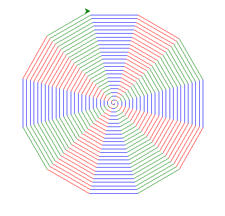
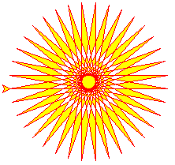
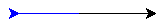
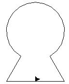
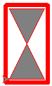
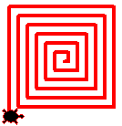
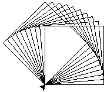

# Documentation :
<a href="https://docs.python.org/fr/3/library/turtle.html" target="_blank">Documentation officielle</a>

# Résumé princiçpales fonctions :
```python
from turtle import *
```

Attention : Sur Basthon il faut penser à mettre ```done()``` à la fin du script sinon il n'y aura aucun affichage


## Obtention d'informations sur la tortue :
| Commande                                              | Explication                                                                                 |
|-------------------------------------------------------|---------------------------------------------------------------------------------------------|
| ```pos() / position()```                              | Obtenir les coordonnées de la tortue au format (x, y)                                       |
| ```heading()```                                       | Obtenir l'orientation actuelle de la tortue : ex : 0-Est / 90-Nord / 180-Ouest / 270-Sud    |
| ```speed()```                                         | Obtenir la vitesse actuelle de la tortue (entre 0 et 10 inclus)                             |
| ```xcor()```                                          | Obtenir la coordonnée x de la tortue                                                        |
| ```ycor()```                                          | Obtenir la coordonnée y de la tortue                                                        |
| ```distance(x, y) / distance(variable)```             | Obtenir la distance entre la tortue et des coordonnées ou une variable [(voir exemple 3 de la documentation dessous)](#exemple-3) |

## Actions sur la tortue :
| Postitons et mouvements                               |                                                                                             |
|-------------------------------------------------------|---------------------------------------------------------------------------------------------|
| ```home()```                                          | Définit la tortue aux coordonnées 0, 0 et définit l'orientation à 0 (vers l'Est)            |
| ```forward(d) / fd(d) ```                             | Avancer d'une distance d dans la direction où elle se dirige                                |
| ```back(d) / bk(d) / backward(d)```                   | Reculer d'une distance d dans la opposé direction où elle se dirige                         |
| ```right(a) / rt(a)```                                | Tourner la tortue vers la droite de a degrés                                                |
| ```left(a) / lt(a)```                                 | Tourner la tortue vers la gauche de a degrès                                                |
| ```goto(x, y) / setpos(x, y) / setposition(x,y)```    | Déplace la tortue vers les coordonnées x y (si le stylo est en bas cela trace une ligne)    |
| ```teleport(x, y)```                                  | Déplace la tortue vers les coordonnées x y (même si le style est en bas cela ne trace rien) |
| ```setx(x)```                                         | Déplace la tortue vers une coordonnée x (ne change pas les coordonnées y de la tortue)      |
| ```sety(y)```                                         | Déplace la tortue vers une coordonnée y (ne change pas les coordonnées x de la tortue)      |
| ```setheading(a) / seth(a)```                         | Définit la position de la tortue à l'angle a : ex : 0-Est / 90-Nord / 180-Ouest / 270-Sud   |


| Formes                                                |                                                                                             |
|-------------------------------------------------------|---------------------------------------------------------------------------------------------|
| ```circle(rayon, partie_dessinee, nb_pas)```          | Dessine un cercle à la gauche de la tortue, rayon : taille du rayon, partie_dessinee : partie du cercle dessiné par exemple 180 pour faire un demi-cercle, nb_pas : nombre de pas utilisés pour faire le cercle par exemple 8 pour faire un octogone |
| ```dot(diametre, color)```                            | Dessine un point, diametre : diamètre du point et color : couleur du point (pour les couleurs voir tableau suivant) |


| Couleurs   | Les chaines de caractères doivent contenir un nom de couleur ou une valeur [hexadécimale](https://htmlcolorcodes.com/color-picker/) ou un code rgb, ex : (255, 25, 56)|
|-------------------------------------------------------|---------------------------------------------------------------------------------------------|
| ```color("color")```                                  | Changer la couleur du trait tracé                                                           |
| ```fillcolor("color")```                              | Changer la couleur de remplissage                                                           |
| ```up() / penup() / pu()```                           | Activer le traçage des lignes                                                               |
| ```down() / pendown() / pd()```                       | Désctiver le traçage des lignes                                                             |
| ```begin_fill()```                                    | Activer le remplissage                                                                      |
| ```end_fill()```                                      | Désactiver le remplissage                                                                   |
| ```pensize(taille) / width(taille)```                 | Règle la taille du trait tracé par la tortue                                                |


## Actions sur l'écran et la fenêtre :
| Commande                                              | Explication                                                                                 |
|-------------------------------------------------------|---------------------------------------------------------------------------------------------|
| ```clearscreen()```                                   | Effacer la fenêtre                                                                          |
| ```mainloop() / done()```                             | Empêcher que la fenêtre se ferme à la fin du script                                         |
| ```exitonclick()```                                   | Permettre que la fenêtre se ferme avec un clic de souris lorsque le dessin est terminé      |
| ```title("titre")```                                  | Changer le titre de la fenêtre                                                              |
| ```speed(v)```                                        | Définit la vitesse de la tortue avec v compris entre 0 et 10 inclus                         |


| Couleurs                                              | Les chaines de caractères doivent contenir un nom de couleur ou une valeur hexadécimale     |
|-------------------------------------------------------|---------------------------------------------------------------------------------------------|
| ```bgcolor("color")```                                | Changer la couleur d'arrière plan de la fenêtre                                             |


## Exemples :
### Exemples de la documentation :
#### Exemple 1 :
```python
from turtle import *
for steps in range(100):
    for c in ('blue', 'red', 'green'):
        color(c)
        forward(steps)
        right(30)
done()
```




#### Exemple 2 :
```python
from turtle import *
color('red')
begin_fill()
fillcolor('yellow')
while True:
    forward(200)
    left(170)
    if abs(pos()) < 1:
        break
end_fill()
done()
```


#### Exemple 3 :
```python
from turtle import *
home()
print(distance(30,40)) # 50.0
# Il est possible de créer plusieurs tortues comme dans l'exemple ci-dessous on crée une tortue joe
joe = Turtle()
joe.forward(77)
color("blue") # On change la couleur de la tortue d'origine en bleu
backward(60)
print(distance(joe)) # 137.0 (77+60=137)
done()
```



### Exemples du cours :
#### Application 1 :
```python
from turtle import *
forward(60) # la tortue avance de 60 pixels
left(120) # la tortue tourne sur elle-même de 120° à gauche
forward(60) # la tortue avance de 60 pixels
right(90) # la tortue tourne de 90° à droite
circle(60, 300) # trace un arc de rayon 60 et d'angle 300°
right(90) # la tortue tourne de 90° à droite
forward(60) # la tortue avance de 60 pixels
goto(0, 0) # revient à la position initiale
#done() # pour pycharm pour que la fenêtre ne se ferme pas
exitonclick() # ou pour que la fenêtre ne se ferme pas à la fin du dessin
done()
```


### Application 2 : Rectangle épais
```python
from turtle import *
width(6) #epaisseur du trait
color(1, 0, 0) # R max, G = 0, B = 0,
goto(60, 0)
goto(60, 110)
goto(0, 110)
goto(0, 0)
#deplacement
up()
goto(5, 5)
down()
#sablier gris clair
width(1)
fillcolor("grey")
begin_fill()
goto(55, 5)
goto(5, 105)
goto(55, 105)
goto(5, 5)
end_fill()
done()
```


### Application 3 :
```python
from turtle import *
def spirale_carre(n, increment):
    speed(5) # parametrage de la vitesse de 1 lent à 10 rapide, 0 étant la vitesse la plus rapide
    shape("turtle") # choix de la forme de la tortue
    pencolor("red") # choix de la couleur du crayon
    pensize(4) # épaisseur du crayon
    up() # lever le crayon
    goto(0, 0) # aller à la position (0,0)
    setheading(0) # orientation de la tortue vers l'Est / 90 Nord / 180 Ouest / 270 Sud
    down() # poser le crayon
    angle = 90 # angle de rotation
    cote = 0 # longueur du coté tracé
    for k in range(4 * n):
        cote = cote + increment
        forward(cote) # avancer de cote pixels
        left(angle) # tourner de angle degrés

spirale_carre(6, 5) # appel de la fonction pour tracer une spirale carrée
done() # indispensable en cas d'exécution dans un IDE
```


### Application 4 :
```python
from turtle import *
def carre(cote):
    for i in range(4):
        forward(cote)
        left(90)
def frise (nbre, cote):
    speed(100)
    for i in range(nbre):
        carre(cote)
        left(5)
frise(10,100)
done()
```

